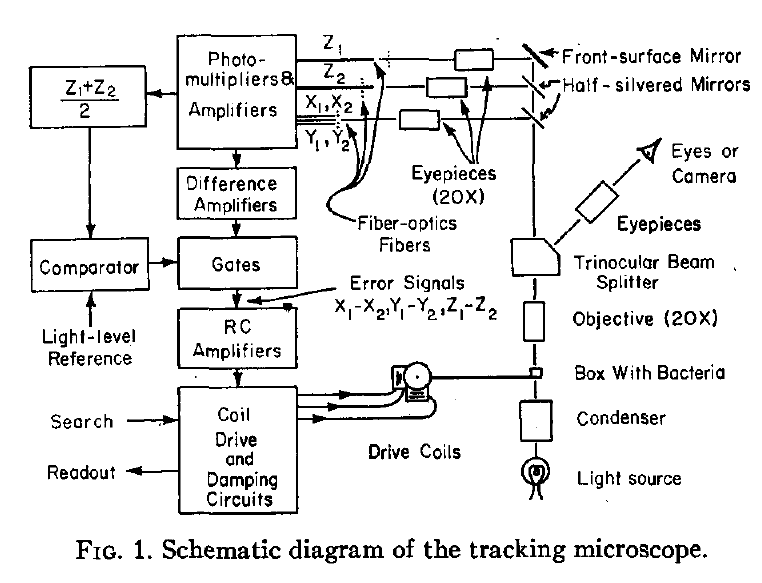
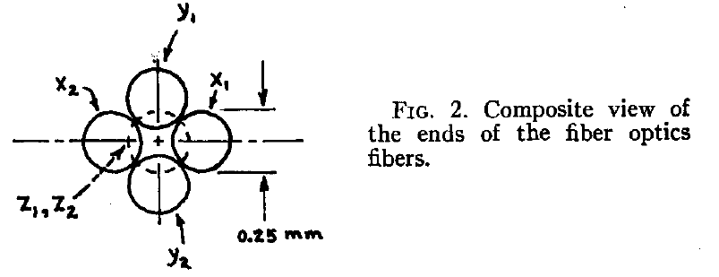

# Bacterial chemotaxis and the first smart microscope
Chemotaxis in bacteria is a molecular mechanism by which they sense chemicals and change their behavior accordingly.
It has been studied extensively since late 60-s and became a triumph of quantitative system biology, 
thanks to giants like [Julius Adler](https://biochem.wisc.edu/emeritus/adler), [Howard Berg](http://www.rowland.harvard.edu/labs/bacteria/people/hberg.php), [Daniel Koshland](http://senate.universityofcalifornia.edu/_files/inmemoriam/html/danielkoshland.html), to name a few. 

Perhaps the most instrumental in this revolution was Howard Berg's tracking microscope [(Berg 1971; PDF)](pdf/1971Berg.pdf "Berg HC. How to track bacteria. Rev Sci Instrum. 1971."), 
which could follow a freely swimming *E.coli* cell in 3D in real time. It allowed precize quantification of cell swimming trajectories 
in spatial and temporal gradients of chemicals, which led to discovery that *E.coli* performs a biased random walk, with longer runs toward increasing concentrations of attractive chemicals and more frequent tumbles when encountering lower concentrations of attractant [(Berg and Brown, 1972; PDF)](pdf/1972Berg-Brown.pdf "Berg HC and Brown DA. Chemotaxis in Escherichia coli analysed by three-dimensional tracking. Nature, 1972"). This work laid the foundation of quantitative approach to *E.coli* chemotaxis, which led to multiple breakthroughs on it's biochemical and physical mechanisms.  

Even today in 2017, building a tracking microscope which keeps rapidly swimming bacterium in focus is not an easy task. 
The system must keep track of cell position in 3D within very small depth of field (due to high magnification) and accurately update servo positions with at least 50 Hz frequency (20 ms intervals). Fast CMOS cameras, real-time operating system, LabView, FPGA, and C/C++ were unknown words in the late 1960-s. Computers were using punch cards and magnetic tapes. 

In a stunning *tour de force* Howard Berg created a
tracking microscope using optic fibers, photomultipliers, off-the-shelf analog electronic components, 
and electomagnetic coils on top of a Nikon upright microscope, at a cost below $10K (equivalent of ~60K in 2017). 
The tracking data were stored using an oscilloscope or magnetic tapes.

The principle of tracking H.Berg proposed is simple and elegant. An image of bacterium (dark-field) is relayed onto 3 pairs of photomultipliers, `x1, x2, y1, y2, z1, z2`. Displacement of the bacterium in `+x` direction stimulates `x1`, so the difference between x-photomulipliers `x1-x2` is amplified and fed into the electromagnetic drive coil which moves the chamber with bacteria. This feedback loop returns the bacteria back to the center of visual field. In `z` direction, when bacteria swims up, it's image becomes more focused on photomultiplier `z1`, the difference of signals `z1-z2` is amplified and fed into the drive coil for `z` axis. If bacteria swims beyond the range of drive coils, the microscope automatically returns to the center position and waits for another bacteria to swim by to start a new tracking. 

*The scene through the binocular is extraordinary. The
bacterium being tracked seems to be stuck to the center
of the field, turning this way and that trying to free itself,
while the other bacteria drift in and out of focus, then to
and from, in apparent synchrony. If the bacterium being
tracked is long, it seems to be stuck at one end and then
at the other; the microscope will track on any part.* [(Berg 1971; PDF)](pdf/1971Berg.pdf "Berg HC. How to track bacteria. Rev Sci Instrum. 1971.")

The exact details on how to tune all the control loops and select the right materials and components are hard to grasp by mere mortals like me. It requires a deep understanding of physics and electrical engineering of Howard Berg, and can serve an inspiration for those who design microscopes today.
